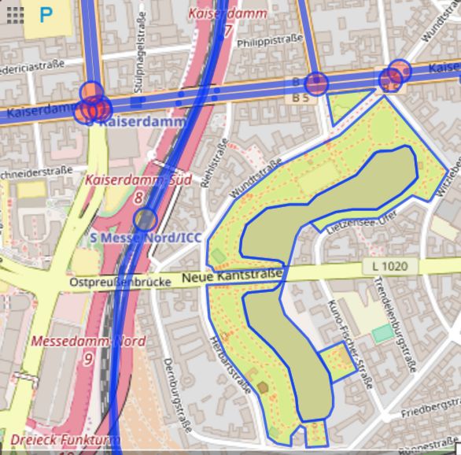
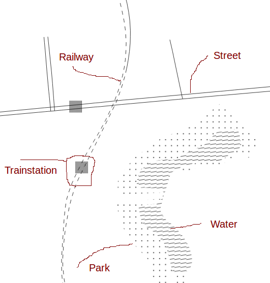

# TactileMaps

Generate tactile versions of Openstreetmaps to be printed on swellpaper.
Application is build for [linepod](https://hpi.de/baudisch/projects/linepod.html), a research sensemaking platform for blind users.

## Used Frameworks and APIs
- [google geocode api](https://developers.google.com/maps/documentation/geocoding/intro) for retrieving bounding box of address
- [overpass api](http://overpass-api.de/api/interpreter) for retrieving openstreetmap data
- [osmtogeojson](https://github.com/tyrasd/osmtogeojson) for converting osm data to json
- [kothic.js](https://github.com/kothic/kothic-js) for rendering openstreetmap data
- [canvas2svg](https://github.com/gliffy/canvas2svg) for rendering to svg rather than canvas
  
  
 **=>** 

                    

Traditionally, the kothic framework renders to canvas, thats why canvas2svg is used. It creates a mock context provides the
same functionality as a normal canvas object but writes to an svg instead.  
  
Much of the functionality that kothic.js offers depends on a raster-image format to be used. As all graphics to be printed by the linepod device need
to be in a vector-image format like svg some adjustments were made to the frameworks to allow additional functionality including

## Symbols  
A `Kothic.symbols` class was added that makes it possible to render OpenStreetMap nodes like trainstations, waterfountains, etc
with svg images. The traditional Kothic framework uses `Kothic.texticons` to achieve the same thing with png images that are
previously imported.

To use a symbol in a map you need to define an object in symbols.js that supports a canvas draw function similar to the examples provided.
You then need to use the non-standard tags `symbol-shape` and `symbol-size` in style.js, passing the previously defined object and an integer for the size as parameters.

## Fill-Patterns  
SVG patterns are loaded dynamically from patterns.js where you can define them similar to the examples provided.
You can then use the non-standart tag `fill-pattern` and pass the id of the pattern as string in style.js.
